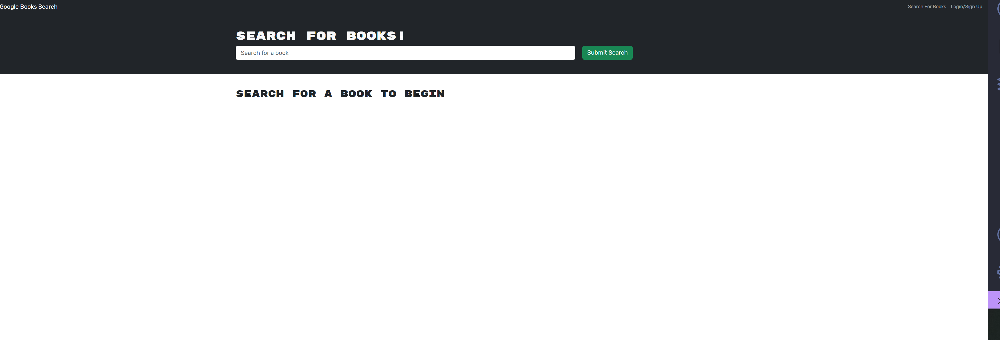

# Book Search Engine

## Description

This app uses the google booksAPI to search books and favorite them.

## Installation

Nothing to install, the app runs at the deployed Link

## Usage

Simply by typing the title of a book you can look up books and add them to your favorites list.

## Mock-Up

The following image shows the web application's appearance and functionality: 

## Deployment Link

